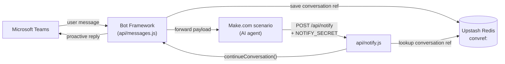
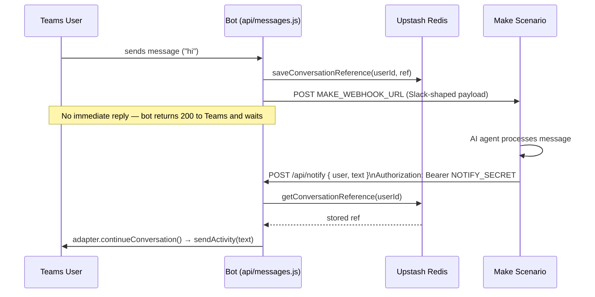

# p-lunaphore-teams-bot

A Microsoft Teams bot that forwards user messages to a Make.com scenario for AI processing, and delivers the AI's response back to Teams proactively once Make calls back.

The bot itself holds no AI logic — it's a thin relay between Teams and Make, with Upstash Redis as the durable link between the two async legs of the conversation.

## Architecture

## Message flow (happy path)

Key point: the bot **never replies synchronously** to a Teams message. It saves the conversation reference, fires the message to Make, and ends the turn. The actual reply only happens later, when Make calls `/api/notify` — at which point the bot uses the stored reference to push a message back into the same conversation.

## Components

| File | Responsibility |
|---|---|
| `api/messages.js` | Bot Framework webhook. Receives Teams activities, delegates to `TeamsBot`. |
| `lib/bot.js` | `TeamsActivityHandler` — on every message, saves the conversation reference and forwards to Make. On member-added, pre-saves the reference so proactive notify works even before the first message. |
| `lib/makeClient.js` | Fire-and-forget POST to `MAKE_WEBHOOK_URL` with a Slack-compatible payload shape (`text`, `user`, `channel`, `ts`, `thread_ts`, ...) since the Make scenario's AI agent expects Slack-style fields. |
| `lib/storage.js` | Upstash Redis KV wrapper. Namespace `convref:<key>` maps a Teams user/channel id to its serialized conversation reference. No schema, no TTL. |
| `api/notify.js` | Callback endpoint for Make. Auth via `Authorization: Bearer <NOTIFY_SECRET>`. Looks up the stored reference and pushes the AI response into Teams via `continueConversation`. |
| `api/simulate.js` | Local/dev harness that mimics the Teams → Make → notify round trip without a real Teams client, useful for testing the Make scenario in isolation. |

## Environment variables

| Variable | Purpose |
|---|---|
| `MicrosoftAppId` | Azure App Registration application (client) ID |
| `MicrosoftAppPassword` | Azure App Registration client secret |
| `MAKE_WEBHOOK_URL` | Make.com scenario webhook that receives incoming Teams messages |
| `NOTIFY_SECRET` | Shared secret Make must send as `Authorization: Bearer <secret>` when calling back `/api/notify` |
| `KV_REST_API_URL` | Upstash Redis REST URL |
| `KV_REST_API_TOKEN` | Upstash Redis REST token |

## Setup

1. **Azure App Registration** (Entra ID → App registrations → New registration) — gives you `MicrosoftAppId` + client secret (`MicrosoftAppPassword`).
2. **Azure Bot resource** — create it, link the existing App Registration, add the Microsoft Teams channel.
3. **Upstash Redis** — create a database, copy REST URL/token.
4. **Deploy to Vercel** — set all env vars above in the project settings, deploy.
5. **Wire the endpoint** — set the Azure Bot's messaging endpoint to `https://<your-domain>/api/messages`.
6. **Make.com scenario** — set its incoming webhook URL as `MAKE_WEBHOOK_URL`, and configure the scenario to call `POST https://<your-domain>/api/notify` with the AI response once done.

## Notes / known gaps

- Conversation references in Redis never expire (no TTL) — stale entries accumulate over time.
- `api/messages.js` polyfills `res.header` (Vercel's response object lacks it, but `botbuilder`'s `CloudAdapter.process` requires it) — without this the adapter throws a Zod validation error and the webhook returns 500.
